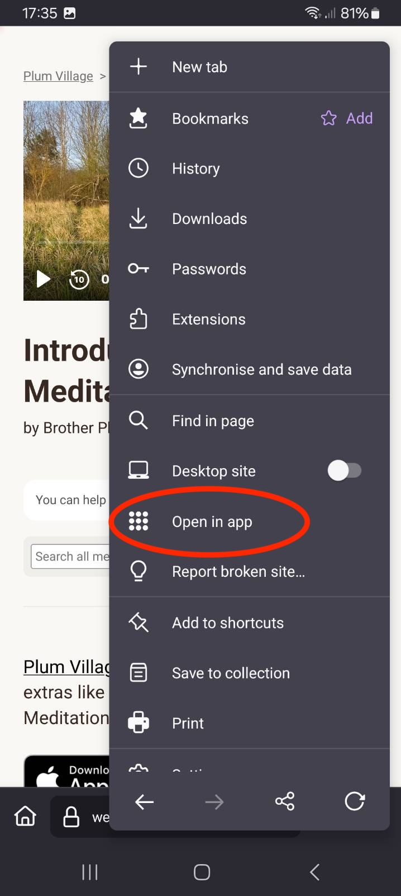

# Testing Universal Links and App Links During Development

**Deep links** look like: `plumvillage://extras/playlists` and continue to work.

We now prefer to use **Universal Links** (iOS) and **App Links** (Android) using the website `https://web.plumvillage.app`. These links will open directly in the mobile app if installed, or fall back to the web version if the app is not installed. The path of these URLs (eg `/item/how-to-dwell-happily-in-the-present-moment-1`) is handled in the mobile app in the same way as deep links.

:::info Migration from Firebase Dynamic Links
We previously used Firebase Dynamic Links (e.g., `https://link.plumvillage.app/drwK`) but [Firebase Dynamic Links is being shut down](https://firebase.google.com/support/dynamic-links-faq) as of August 25, 2025. 

**Key differences:**
- **Firebase Dynamic Links**: Worked even when app wasn't installed by redirecting to app stores
- **Universal/App Links**: Only work when app is installed, but provide better UX and are linked to a website that works as fallback
- **Deep Links**: Custom URL scheme that only works when app is installed, no web fallback
:::

## Configuration Requirements

Universal Links and App Links have been configured for the `web.plumvillage.app` domain:

### iOS Universal Links
- Associated domains entitlement configured
- [`apple-app-site-association`](https://web.plumvillage.app/.well-known/apple-app-site-association) file hosted

### Android App Links
- Intent filters with `android:autoVerify="true"` configured
- [`assetlinks.json`](https://web.plumvillage.app/.well-known/assetlinks.json) file hosted

:::note
The configuration files and app associations are already set up. No additional configuration is required for development.
:::

## Unit Tests

The deep linking mechanism will [map a path to a route state, and vice versa](https://reactnavigation.org/docs/configuring-links#mapping-path-to-route-names) (route state to a path).

It is easy to break this mapping if editing `DeepLinkingConfig.ts`, so please add a unit test for each new path to [deep-link-tests.ts](https://github.com/plumvillage/plumvillage-app/blob/master/src/screens/Main/__tests__/deep-link-tests.ts). Run the tests with `yarn test`. This ensures that the new URLs work as expected, but also that the existing URLs continue to work as expected.

You can usually copy and edit another unit test but if doing something more complex you may need to intercept the navigation state and print with `console.log(JSON.stringify(state))` in `DeepLinkingConfig.ts`.

## Testing on Device

Unit tests are the quickest way to check quickly during development, but once you are fairly sure it is working correctly, it is wise to test on a device.

### Android

**App Links** and **deep links** will launch the debug build if release build is not installed on the test device. App Links may or may not work on Android emulators, so test on a real device if you have problems on the emulator.

Deep link: `npx uri-scheme open plumvillage://extras/playlists --android`

App Link: `npx uri-scheme open https://web.plumvillage.app/extras/playlists --android`

### iOS

You can test deep links with a normal debug build: `npx uri-scheme open plumvillage://extras/playlists --ios`

For Universal Links:

1. [Change build configuration to **Release**](https://pinkstone.co.uk/deploying-your-app-from-xcode-to-a-device-with-release-build-configuration/)
2. [Enable verbose logging in release mode](https://stackoverflow.com/a/39091109/2902497)
3. Test with: `npx uri-scheme open https://web.plumvillage.app/extras/playlists --ios`
4. Revert these changes when done

## Alternative Testing Methods

Besides using `npx uri-scheme`, you can test Universal Links and App Links using these methods:

### iOS Testing

**Share and tap method (recommended):**
- Use the share button in the app to generate a link like `https://web.plumvillage.app/item/-LEf3l4wwkuXSXQwoiq7`
- Send the link via Messages, Signal, WhatsApp, Notes, Email, or others
- Tap the link from the message - this should open directly in the app (seamless transition, no browser)
- This tests the actual Universal Link behavior that users experience

**Browser testing:**
- Open Safari, Chrome, or Firefox on your iOS device
- Navigate to a shared URL or manually type `https://web.plumvillage.app/extras/playlists`
- Links typed directly into browser address bars will open in the browser
- This is also the web experience for users without the app
- Some browsers may also show an "open in app" option (UX differs by browser)

**macOS (Browser or Share & Tap):**
- The app runs as a "built for iPad" app on macOS
- Universal Links work similarly - direct opening in app when tapped from other apps (Notes, Mail, Signal, etc)
- Web fallback when typed in browser, possibly with an "open in app" option depending on browser.

#### Browser Examples on iOS / iPadOS

Safari tends to highlight Universal Links but other browsers may not.

**Safari on iPadOS:**

#### Browser Examples on macOS

Safari and Chrome will highlight Universal Links, but other browsers may not.

**Safari on macOS:**

**Chrome on macOS:**

### Android Testing

**Share and tap method (recommended):**
- Use the share button in the app to generate a link like `https://web.plumvillage.app/item/-LEf3l4wwkuXSXQwoiq7`
- Send the link via Messages, Signal, WhatsApp, Google Keep, Email, or others
- Tap the link from the message - this should open directly in the app (no disambiguation dialog)
- This tests the actual App Link behavior that users experience

**Browser testing:**
- Open Chrome, Firefox, or Samsung Internet on your Android device
- Navigate to a shared URL or manually type `https://web.plumvillage.app/extras/playlists`
- Links typed directly into browser address bars will open in the browser
- Some browsers may also show an "open in app" option (UX differs by browser)

#### Browser Examples on Android

Few browsers highlight App Links, but Firefox gives the option to open in the app.

**Firefox on Android:**

## URL Pattern Examples

The app supports various URL patterns that map to different screens and navigation states:

### Homepage
- **URL**: `https://web.plumvillage.app/` or `https://web.plumvillage.app/home`
- **Behavior**: Opens the app to the main home screen

### Tab Navigation
- **URL**: `https://web.plumvillage.app/meditations`
- **Behavior**: Opens the app directly to the Meditations tab
- **Other tabs**: Replace `meditations` with other tab names like `teachings`, `extras`, etc.

### Folder Navigation
- **URL**: `https://web.plumvillage.app/meditations/start-here`
- **Behavior**: Opens the app to the "Start Here" folder within the Meditations tab
- **Pattern**: `https://web.plumvillage.app/[tab]/[folder-slug]`

### Individual Items
- **URL**: `https://web.plumvillage.app/item/how-to-dwell-happily-in-the-present-moment-1`
- **Behavior**: Opens the app directly to the specific meditation, teaching, or content item
- **Pattern**: `https://web.plumvillage.app/item/[item-slug-or-id]`

### Special Pages
- **URL**: `https://web.plumvillage.app/latest-updates`
- **Behavior**: Opens the app to the Latest Updates screen

